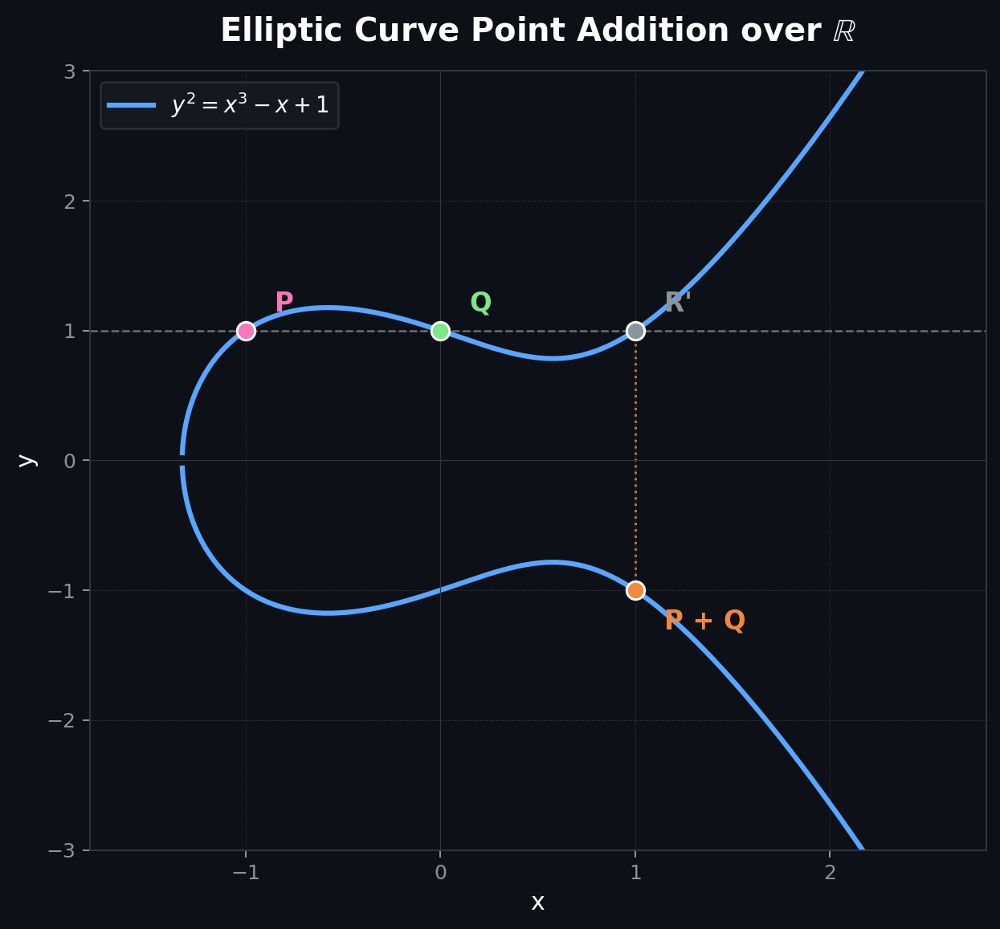
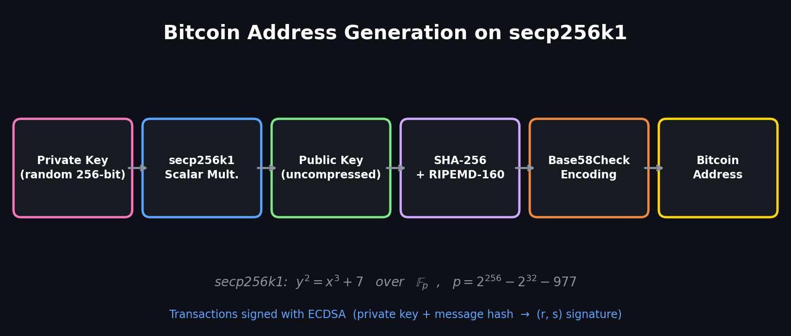

# Elliptic Curve Cryptography

An implementation of **Elliptic Curve Cryptography (ECC)** from scratch in Python, covering the full mathematical foundation — from point arithmetic on curves over real numbers and finite fields, to real-world cryptographic protocols like **ECDH key exchange**, **AES encryption**, **ECDSA signatures**, and **Bitcoin address generation**.

---

## What This Project Does

### Elliptic Curve Arithmetic

<p align="center">
  
</p>

- **Point addition** and **scalar multiplication** on curves over both **R** and **F_p** (finite fields)
- **Double-and-add** algorithm for efficient scalar multiplication
- Curve order computation using **Hasse's theorem**
- **Tonelli-Shanks** algorithm for modular square roots
- **Cyclic subgroup generation** with proper base point selection
- Abelian group property verification (closure, associativity, commutativity, neutral element, inverse)

### Cryptographic Protocols (ECDH + AES)
- Full **Elliptic Curve Diffie-Hellman (ECDH)** key exchange between two parties
- Shared secret derivation using **HKDF**
- Message encryption/decryption with **AES-256-GCM** (authenticated encryption)

### Bitcoin Simulation

<p align="center">
  
</p>

- Implementation of the **secp256k1** curve (the curve used by Bitcoin)
- **Bitcoin address generation**: private key → public key → SHA-256 → RIPEMD-160 → Base58Check encoding
- **ECDSA** transaction signing and verification on secp256k1
- Fictitious transaction creation and signing flow

### Benchmarking
- Performance comparison between **RSA (3072 bits)** and **ECDH (256 bits)** at equivalent 128-bit security
- Benchmarks for key generation, encryption, and decryption times
- Key size comparison charts

---

## Project Structure

```
├── Curve.py                        # Abstract base class for elliptic curves
├── Point.py                        # Point representation
├── EllipticNoneFiniteCurve.py      # Elliptic curve over R
├── utils.py                        # Utilities (factorize, gcd, double-and-add, Tonelli-Shanks, Fermat primality)
├── TestAbelian.py                  # Abelian group property tests
├── TestEllipticNoneFiniteCurve.py  # Tests for curves over R
├── PointTest.py                    # Point equality tests
│
├── Crypto/
│   ├── EllipticFiniteCurve.py      # Elliptic curve over F_p
│   ├── TestCrypto.py               # ECDH key exchange + AES encryption demo
│   ├── TestEllipticCurveFinite.py  # Tests for finite field curves
│   └── Benchmark/
│       ├── main.py                 # RSA vs ECDH benchmark with charts
│       ├── benchmark.py            # Benchmark timing utilities
│       ├── crypto.py               # ECC and RSA encryption wrappers
│       ├── BenchmarkECDH.py        # ECDH-specific benchmark
│       └── BenchmarkRSAvsECDH.py   # Side-by-side RSA vs ECDH comparison
│
├── Bitcoin/
│   ├── SECP256k1.py                # secp256k1 curve implementation
│   ├── BitcoinPerson.py            # Bitcoin address generation, ECDSA signing/verification
│   └── SECP256k1Demonstration.py   # Full Bitcoin demo (address, transaction, signature)
│
└── IntroductionToECC.pdf        # Introduction to ECC reference document
```

---


## Usage

**ECDH key exchange + AES encryption** (using our own elliptic curve implementation):
```bash
cd Crypto && python TestCrypto.py
```

**RSA vs ECDH benchmark** (with comparison charts):
```bash
cd Crypto/Benchmark && python main.py
```

**Bitcoin demo** (address generation, transaction signing, signature verification on secp256k1):
```bash
cd Bitcoin && python SECP256k1Demonstration.py
```

**Run tests:**
```bash
python TestEllipticNoneFiniteCurve.py
cd Crypto && python TestEllipticCurveFinite.py
```

---

## Documentation

A complete paper covering the theory and implementation details of this project is available in the repository: **`IntroductionToECC.pdf`**. It covers elliptic curve definitions, group theory, point addition, scalar multiplication, finite field curves, cyclic subgroups, ECDH, ECDSA, El Gamal on elliptic curves, and the Baby Step Giant Step attack.

---

## Known Limitations

- **Curve order computation** is brute-force (no Schoof's algorithm), so large primes p make it very slow. For example, p = 5791 takes ~11.5 seconds.
- The ECDSA verification in the Bitcoin demo has a known issue that was not debugged in time.
- This is an educational implementation — not suitable for production use.

